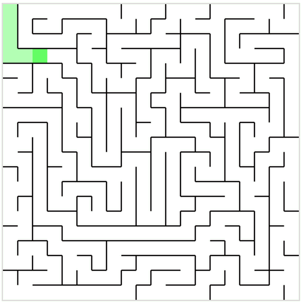

# Maize

[](https://travis-ci.org/codecation/maize)

Generates and solves random mazes using a depth first search. See it running
live at [codecation.github.io](http://codecation.github.io/2014-02-clojure-rica).



## Usage

Grab the code:

```bash
$ git clone https://github.com/codecation/maize.git
$ cd maize
```

Compile it:

```bash
$ lein compile
```

And take a peek:

```bash
$ open site/index.html
```

## Contributing
Please see the [Contributing
Document](https://github.com/codecation/maize/blob/master/CONTRIBUTING.md)

## License
Copyright (C) 2014 Ben Orenstein, Chris Hunt, [MIT
License](https://github.com/codecation/maize/blob/master/LICENSE.txt)
